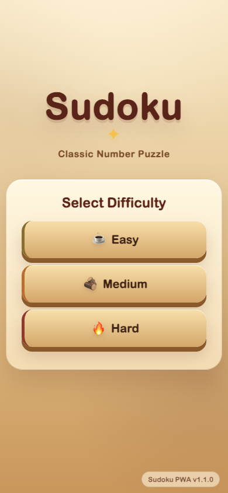
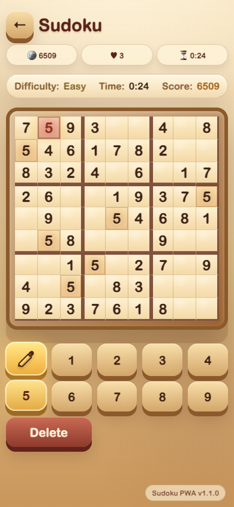

# Sudoku PWA

Ein liebevoll gestaltetes Sudoku-Spiel als Progressive Web App – warm, ruhig und mobil optimiert. Die Oberfläche ist im Stil eines handgemachten Casual-Mobile-Games gestaltet: Pergamentpapier, Holzbrett-Anmutung, weiche Schatten und große Touch-Flächen statt technischer Dashboard-Optik.

## Direkt spielen

👉 **[Sudoku PWA auf GitHub Pages öffnen](https://hkiam.github.io/sudoku-pwa/)**

## Screenshots

| Startmenü | Spielansicht |
| --- | --- |
|  |  |

## Highlights

- **Mobile-first Sudoku** mit großem zentralem Board und komfortabler Zahlenleiste.
- **Warmer Casual-Game-Look** mit Creme-, Beige-, Sand- und Holzbraun-Tönen.
- **Taktile UI**: Buttons wirken wie kleine Spielsteine mit weichen Schatten und Press-Animation.
- **Fokus-States**: aktive Zellen leuchten golden, gleiche Zahlen werden sanft hervorgehoben.
- **Pencil-/Notizmodus** für Kandidatenzahlen.
- **Score, Timer und Schwierigkeitsgrade** für schnelle mobile Spielrunden.
- **PWA-fähig** mit Manifest und GitHub-Pages-kompatiblen relativen Asset-Pfaden.

## Bedienung

1. Schwierigkeit auswählen: **Easy**, **Medium** oder **Hard**.
2. Eine Zahl in der unteren Zahlenleiste antippen.
3. Eine freie Sudoku-Zelle antippen, um die Zahl einzutragen.
4. Den Stift-Button aktivieren, um Notizen zu setzen.
5. Mit **Delete** die ausgewählte Zelle leeren.
6. Über den Pfeil oben links zurück ins Menü wechseln; vorher erscheint eine Abbruchbestätigung.

## Designrichtung

Die UI soll sich wie ein gemütliches Rätselbuch auf einem Café-Holztisch anfühlen:

- Pergament-/Papier-Hintergrund mit leichter Körnung
- Holzbrett-artiger Sudoku-Rahmen
- warme Fehler- und Highlight-Farben
- runde, freundliche Typografie über lokale Font-Fallbacks
- weiche Microinteractions und dezente Animationen

## Technik

- React 18
- Vite 5
- Progressive Web App Manifest
- Playwright E2E Tests
- GitHub Pages Deployment über statische Dateien im Repository

## Lokal starten

```bash
npm install
npm run dev
```

Die lokale Entwicklungsvariante lädt direkt `src/main.jsx` über Vite.

## Produktionsbuild

```bash
npm run build
```

Der Build erzeugt stabile Dateien unter `dist/assets/index.js` und `dist/assets/index.css`, damit GitHub Pages die App zuverlässig unter `/sudoku-pwa/` laden kann.

## Tests

```bash
npx playwright test
```

Die Tests prüfen unter anderem Menü, Schwierigkeitsauswahl, Spielstart, Rückkehr ins Menü und Manifest-Version.

## Projektstruktur

```text
src/
  App.jsx          Sudoku-Logik, Spielzustand und UI
  main.jsx         React-Einstiegspunkt
  styles.css      warmes Casual-Game-Designsystem
docs/screenshots/  README-Screenshots
dist/              statische Build-Ausgabe für GitHub Pages
tests/             Playwright E2E Tests
```
